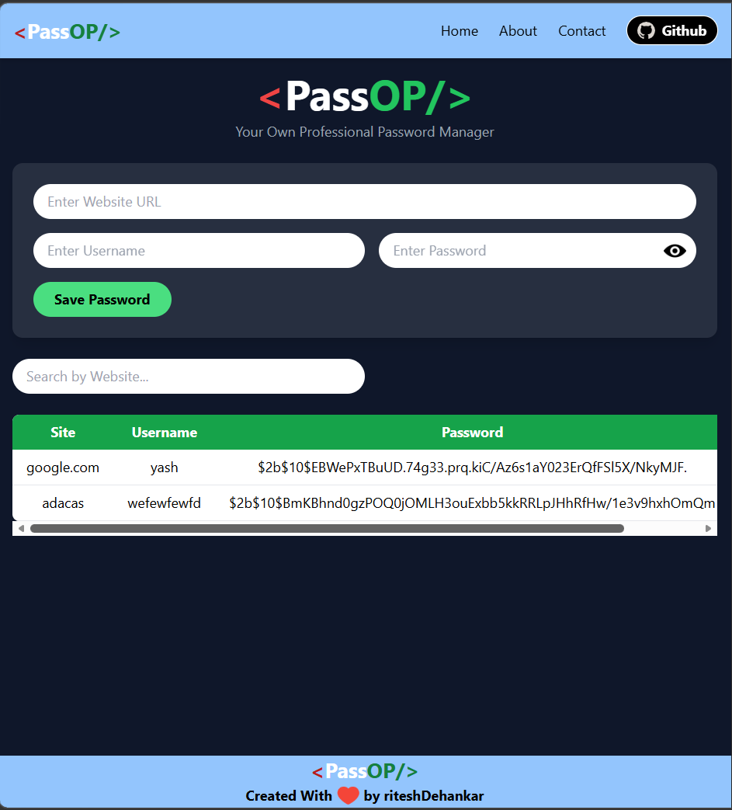

# 🔐 PassOP – Password Manager

PassOP is a **full-stack password manager built using the MERN stack (MongoDB, Express, React, Node.js)**.  
It allows users to securely store, search, edit, and manage website credentials through a modern and responsive interface.

---

## 🚀 Features

✔ Save website credentials  
✔ Edit saved passwords  
✔ Delete stored credentials  
✔ Copy username / password 📋  
✔ Show / hide password 👁  
✔ Search passwords instantly 🔍  
✔ MongoDB database integration  
✔ REST API backend with Express

---

## 🛠 Tech Stack

**Frontend**
- React
- Tailwind CSS
- React Toastify

**Backend**
- Node.js
- Express.js

**Database**
- MongoDB

---

## 📸 Project Screenshot

---

## 📂 Project Structure

passop-password-manager
│
├── backend
│ ├── server.js
│ └── package.json
│
├── frontend
│ ├── src
│ │ ├── components
│ │ │ └── Manager.jsx
│ │ └── App.jsx
│
└── README.md
